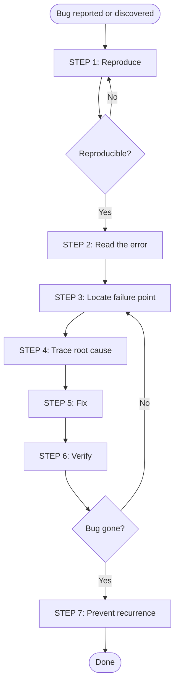

# Debugging Workflow

## Overview



**Never skip to STEP 5 without completing STEP 4.**
Root cause first — fix second.

---

## STEP 1 — Reproduce

Confirm the bug exists and understand exact conditions.

Questions:

- What exact input or action triggers it?
- Does it happen every time, or only sometimes?
- What environment? (OS, runtime version, browser)
- When did it start? What changed recently?

```text
❌ Do not fix an unreproduced bug
✅ Write a failing test that reproduces the bug before fixing it
```

## STEP 2 — Read the Error

- Read the **full** error message — not just the first line
- Read the **full** stack trace — find which line in your code triggered it
- Note the error type and any error codes
- Check logs for events that happened before the error

## STEP 3 — Locate the Failure Point

**Binary search:**
Does the bug happen before or after line 50?
→ Before: look at lines 1–50
→ After: look at lines 50–100
Repeat until you find the exact line.

**Add temporary logging:**

```python
print(f"[DEBUG] value before transform: {value}")
result = transform(value)
print(f"[DEBUG] value after transform: {result}")
```

Remove all debug logs after fixing.

## STEP 4 — Trace the Root Cause

Ask "why" at each level until you reach the root:

```text
Why did this value become null?
  → Because the caller passed null.
Why did the caller pass null?
  → Because the DB query returned no results.
Why did the DB query return no results?
  → Because the user_id was wrong.
Root cause: JWT decoded with wrong key.
```

## STEP 5 — Fix

State the fix clearly before writing it:

```text
Root cause: [what was wrong and why]
Fix: [what exactly will change]
Side effects: [what else might be affected]
```

Rules:

```text
✅ Fix the root cause — not the symptom
✅ Make the smallest change that fixes the bug
✅ Keep the fix isolated from refactoring
❌ Do not add null checks to hide a bug without understanding why it's null
❌ Do not catch and swallow exceptions without logging
❌ Do not change multiple things at once
```

## STEP 6 — Verify

```markdown
- [ ] Original reproduction case no longer triggers the bug
- [ ] Failing test now passes
- [ ] Full test suite passes
- [ ] Tested in the same environment where the bug occurred
```

## STEP 7 — Prevent Recurrence

```markdown
- [ ] Write a regression test that would have caught this bug
- [ ] Add a comment explaining why the fix works (if non-obvious)
- [ ] Check if the same pattern exists elsewhere in the codebase
- [ ] Add input validation if root cause was unexpected input
```
