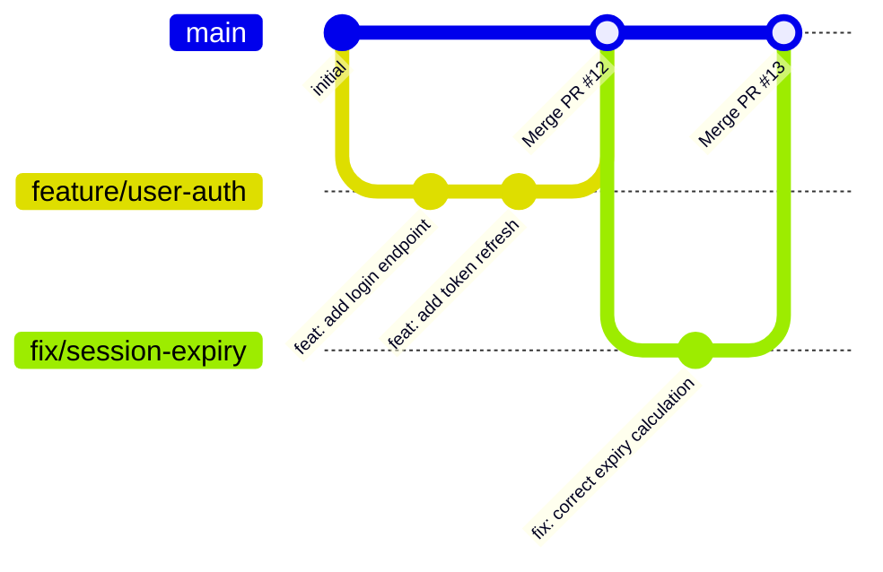

# Branching

## Naming Convention

```markdown
[type]/[short-description]
[type]/[ticket-id]-[short-description]
```

Types:

- `feature/` — new functionality
- `fix/` — bug fix
- `hotfix/` — urgent production fix
- `refactor/` — code restructuring without behavior change
- `chore/` — maintenance, dependency updates, config changes
- `docs/` — documentation only

Rules:

- Use kebab-case: `feature/user-password-reset` not `feature/UserPasswordReset`
- Include ticket ID when available: `feature/AUTH-123-password-reset`
- Keep it short and descriptive — avoid generic names like `feature/changes`
- No personal names: `feature/johns-work` is not acceptable

---

## Branching Strategies

### GitHub Flow (recommended for most projects)



Rules:

- `main` is always deployable
- Work in short-lived feature branches
- Merge via PR — never directly to main
- Deploy immediately after merging

### GitFlow (for versioned releases)

```text
main      — production releases only
develop   — integration branch for next release
feature/* — new features, branch from develop
release/* — release preparation, branch from develop
hotfix/*  — urgent fixes, branch from main
```

### Trunk-Based Development

```text
main — everyone commits here (or very short-lived branches < 24h)
```

Use feature flags to hide incomplete work in production.

---

## Branch Lifecycle

```text
1. Create branch from latest main (or develop in GitFlow)
2. Make changes in small, focused commits
3. Push and open PR early — use draft if not ready for review
4. Address review feedback
5. Merge when approved and CI passes
6. Delete branch immediately after merge
```
