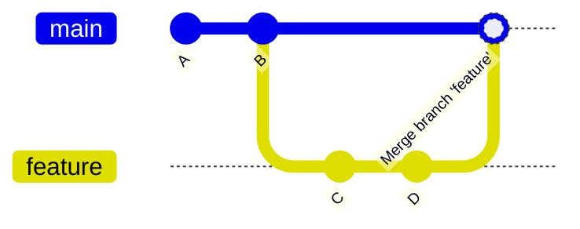

# Merge Strategy

Choose one strategy and apply it consistently across the project.

---

## Options

### Merge Commit



**Result:** Preserves full branch history. Creates a merge commit.

**Use when:**

- Full history traceability is important
- Multiple contributors worked on the branch
- The branch has meaningful intermediate commits

---

### Squash Merge

All commits on the branch are combined into a single commit on main.

**Result:** Clean linear history on main. Branch history is lost.

**Use when:**

- Feature branches have noisy intermediate commits (fixups, typos)
- You want main history to read as a log of features and fixes
- Each PR represents one logical unit of work

---

### Rebase Merge

Commits are replayed on top of main without a merge commit.

**Result:** Linear history. No merge commit. Original commit order preserved.

**Use when:**

- You want linear history without squashing
- All commits on the branch are clean and meaningful

---

## Comparison

| Strategy | History | Traceability | Clean main |
| ---------- | --------- | -------------- | ----------- |
| Merge commit | Non-linear | Full branch history | No |
| Squash | Linear | Per-PR only | Yes |
| Rebase | Linear | Full commit history | Yes |

---

## Rules

```text
✅ Choose one strategy and enforce it via repository settings
✅ Use squash for feature branches with messy commit history
✅ Use merge commit when branch history is meaningful
❌ Never force-push to main, develop, or any shared branch
❌ Never rebase a branch that others are working on
```
