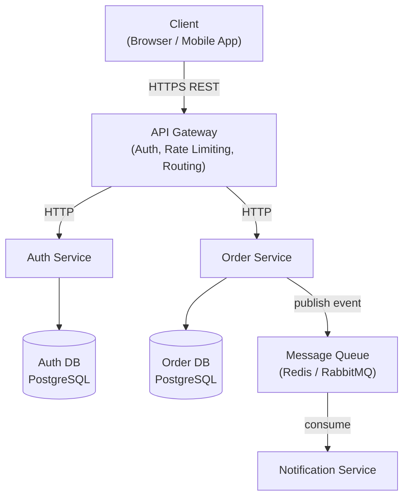
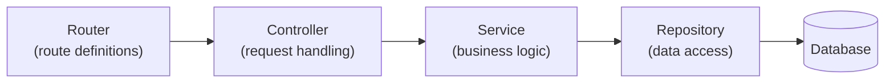
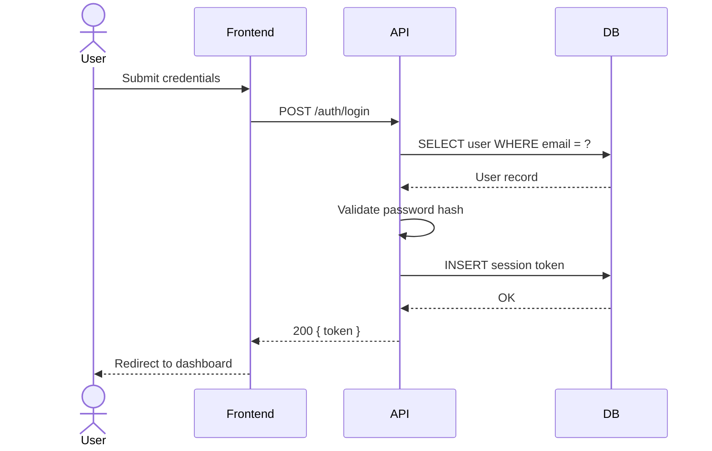
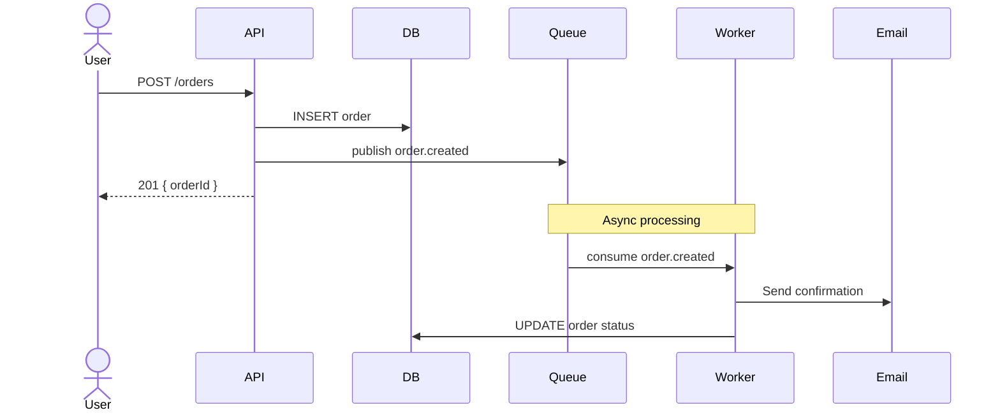

# System & Component Architecture Diagrams

Use Mermaid.js `graph` or `C4Context` syntax for architecture diagrams.

---

## System Architecture (graph syntax)



---

## Component Diagram (within a single service)



---

## Sequence Diagram



---

## Async Sequence



---

## Rules

```text
✅ Show every external dependency (payment providers, email, SMS, CDN)
✅ Note the communication protocol on each arrow (HTTPS, gRPC, events)
✅ Identify single points of failure
✅ Show where data is stored
✅ Use sequenceDiagram for request flows, graph for topology
❌ Do not design in isolation — review existing architecture first
❌ Do not combine more than one concern in a single diagram
```
