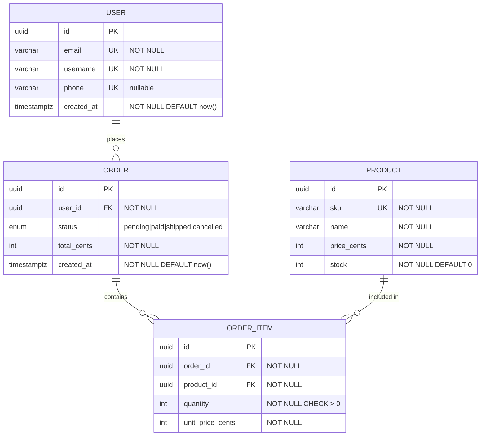

# ERD — Entity Relationship Diagram

Use Mermaid.js `erDiagram` syntax. Renders in GitHub, GitLab, Notion, and most documentation tools.

---

## Key Types

| Symbol | Type | Meaning |
| -------- | ------ | --------- |
| PK | Primary Key | One per entity. Unique, not null. |
| UK | Unique Key | Multiple allowed. Unique. May be nullable. |
| FK | Foreign Key | References PK of another entity. |
| IDX | Index | Not a constraint. For query performance only. |

---

## Mermaid Syntax



---

## Relationship Cardinality

| Notation | Meaning |
| ---------- | --------- |
| \|\|--\|\| | One to one |
| \|\|--o{ | One to many |
| }o--o{ | Many to many |
| \|\|--o\| | One to zero or one |

---

## Rules

```text
✅ Every entity must have exactly one PK (prefer uuid over integer)
✅ Use timestamptz for datetime fields — not timestamp
✅ Monetary values in integer cents — not float or decimal
✅ Add UK for every field with a business uniqueness constraint
✅ Document nullable vs NOT NULL on every field
✅ Add IDX on all FK columns (for join performance)
❌ Do not use generic field names: data, info, record, value
❌ Do not store multiple values in one field — normalize instead
```
