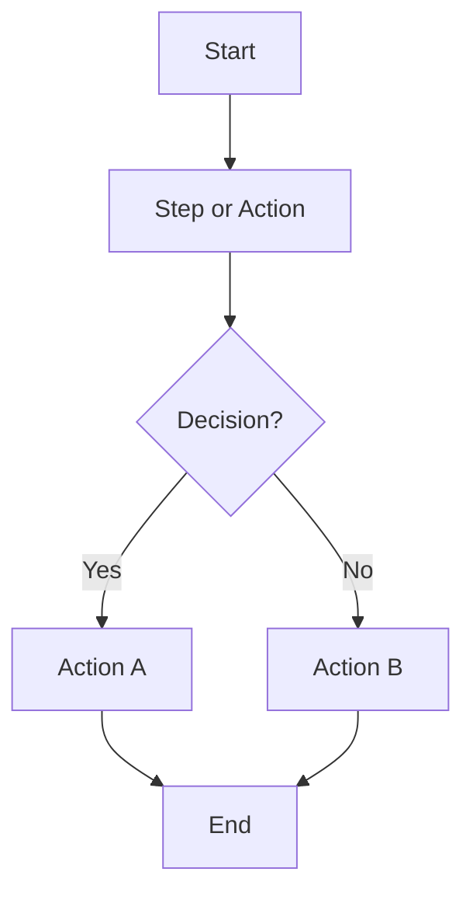
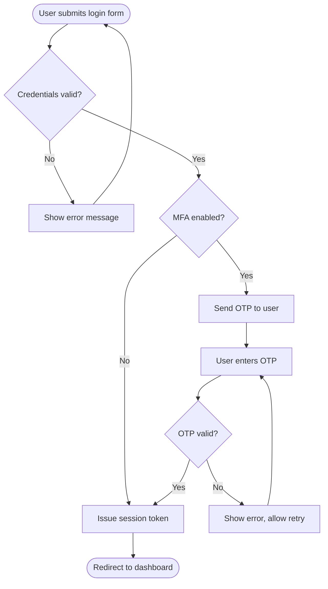
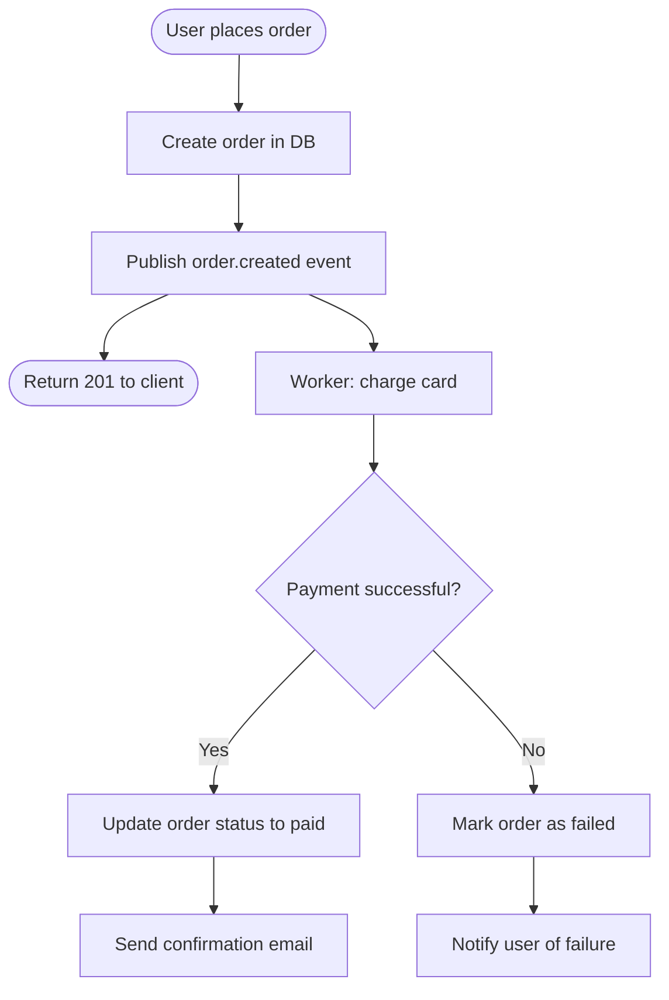

# Flowchart & User Flow

Use Mermaid.js `flowchart` syntax. Renders in GitHub, GitLab, Notion, and most documentation tools.

---

## Basic Syntax



---

## Node Types

| Syntax | Shape | Use for |
| -------- | ------- | --------- |
| `[Text]` | Rectangle | Action or step |
| `{Text}` | Diamond | Decision or condition |
| `(Text)` | Rounded | Start or end |
| `([Text])` | Stadium | Terminal event |
| `[[Text]]` | Subroutine | Sub-process |

---

## Example: User Login Flow



---

## Example: Async Order Flow



---

## Rules

```text
✅ Every flow must have a clear start and end node
✅ Every decision node must have all possible branches
✅ Include error paths — they are as important as happy paths
✅ One diagram per concern — split complex flows into sub-diagrams
✅ Use TD (top-down) for process flows, LR (left-right) for state machines
❌ Do not exceed 3 levels of nesting — split into sub-diagrams instead
```
