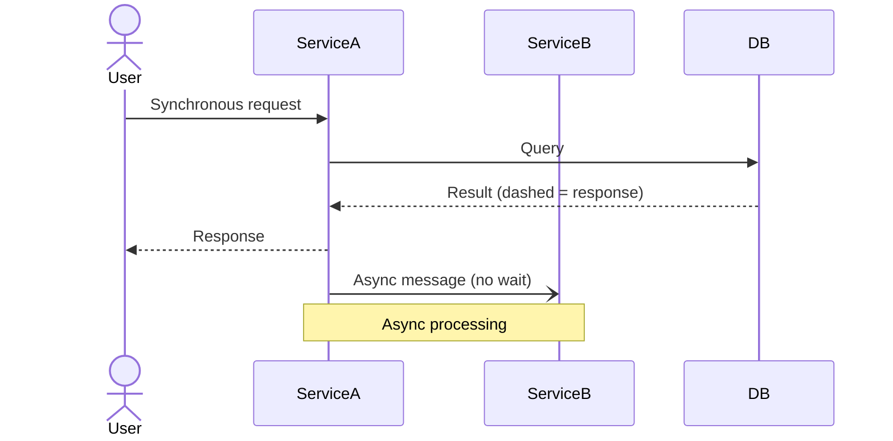
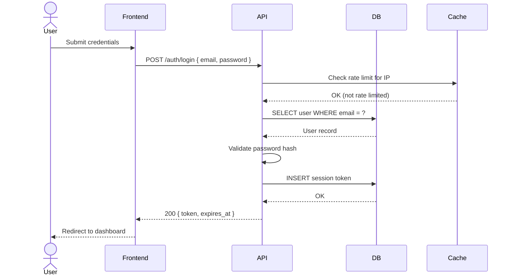
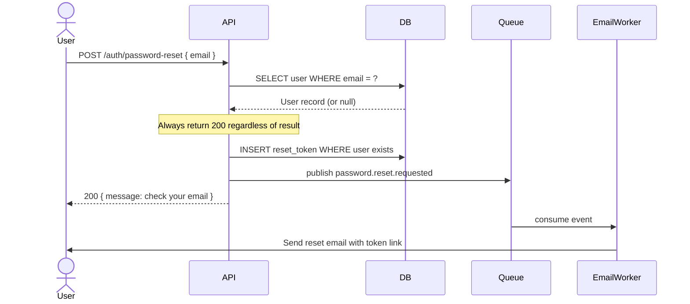

# Sequence Diagrams

Use Mermaid.js `sequenceDiagram` syntax.
For architecture topology, see `architecture.md`.

---

## Syntax Reference



---

## Login Flow



---

## Password Reset Flow



---

## Rules

```text
✅ Use actor for humans, participant for systems
✅ Dashed arrows (-->) for responses, solid (->) for requests
✅ Use Note to annotate important decisions or async boundaries
✅ Show error flows as separate diagrams — do not branch inside one diagram
✅ Name participants consistently across all diagrams in the project
```
