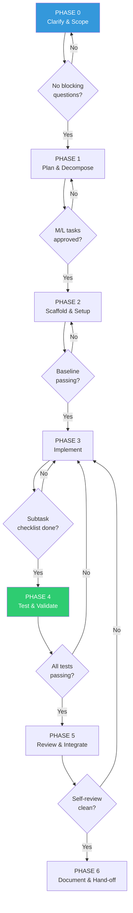
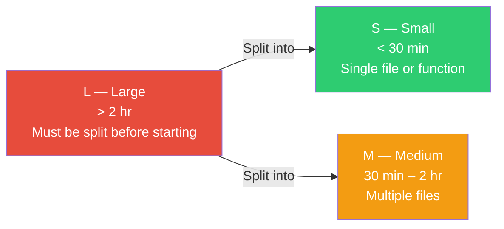

# Task Decomposition — Phase Reference

## Phase Flow



Skip PHASE 2 if the environment already runs.
Skip PHASE 6 if no public interface changed.
Minimum for any task: PHASE 0 → 1 → 3 → 4.

---

## PHASE 0 — Clarify & Scope

**Goal:** Fully understand the task before doing anything.

Required output:

```markdown
- [ ] Problem statement in 1–2 sentences
- [ ] Confirmed assumptions
- [ ] Out-of-scope items
- [ ] Blocking questions (must be resolved before proceeding)
```

**Gate:** No blocking questions remain.

---

## PHASE 1 — Plan & Decompose

**Goal:** Break the task into ordered, actionable sub-tasks.

Sub-task sizes:



Task tree format:

```text
TASK: [main task name]
├── SUB-TASK 1: [description] [S]
├── SUB-TASK 2: [description] [M] — depends on 1
└── SUB-TASK 3: [description] [S] — parallel with 2
```

Required output:

```markdown
- [ ] Ordered sub-task list with size estimates (S/M/L)
- [ ] Dependency map (what blocks what)
- [ ] Skills needed per sub-task identified
- [ ] Key risks identified
```

**Gate:** M/L tasks approved by user before execution starts.

---

## PHASE 2 — Scaffold & Setup

**Goal:** Foundation before core implementation.

Required output:

```markdown
- [ ] Environment runs without errors
- [ ] Folder structure matches project conventions
- [ ] Baseline / smoke test passes
```

**Gate:** Baseline is green.

---

## PHASE 3 — Implement

**Goal:** Execute sub-tasks one by one.

Rules:

- Complete one sub-task fully before moving to the next.
- Commit or checkpoint after each sub-task.
- L-sized sub-tasks must be decomposed before starting.
- Read the relevant skill before starting each sub-task.

Per-sub-task checklist:

```markdown
- [ ] Relevant skill(s) read before starting
- [ ] Implementation complete
- [ ] Docstrings on all functions, methods, classes
- [ ] Inline comments on complex / non-obvious logic
- [ ] Unit tests written
- [ ] No lint or type errors
- [ ] No regressions in other modules
- [ ] Committed with a descriptive message
```

Commit format:

```text
feat(scope): short description

- change detail 1
- change detail 2

Resolves: SUB-TASK-X
```

**Gate:** Every sub-task passes its checklist before the next begins.

---

## PHASE 4 — Test & Validate

**Goal:** Confirm correctness; no regressions.

Read the `testing` skill before running this phase.

Required output:

```markdown
- [ ] Full test suite passes
- [ ] Coverage not below baseline
- [ ] All acceptance criteria from Phase 1 met
```

**Gate:** Zero failing tests. If bugs found → read `debugging` skill, return to Phase 3.

---

## PHASE 5 — Review & Integrate

**Goal:** Code is clean and ready to merge.

Checklist:

```markdown
- [ ] No debug statements
- [ ] No hardcoded values that belong in config
- [ ] Naming consistent with codebase conventions
- [ ] All public functions/methods have docstrings
- [ ] PR description clearly written
```

**Gate:** Self-review is clean.

---

## PHASE 6 — Document & Hand-off

**Goal:** Work can be continued by another person or agent.

Read the `documentation` skill before running this phase.

Required output:

```markdown
- [ ] Docs updated if public API or interface changed
- [ ] Work summary written
- [ ] Known issues / follow-up tasks recorded
```

---

## Progress Report Format

```text
## Progress

Task: [name]
Phase: PHASE X — [name]
Status: 🟡 In Progress | ✅ Done | 🔴 Blocked

Completed:
- ✅ PHASE 0: Scope confirmed
- ✅ PHASE 1: 4 sub-tasks planned

In Progress:
- 🟡 PHASE 3: Sub-task 2/4 — [description]

Waiting:
- ⏳ PHASE 3: Sub-tasks 3, 4

Blockers:
- 🔴 [description] — needs: [what is required]
```
