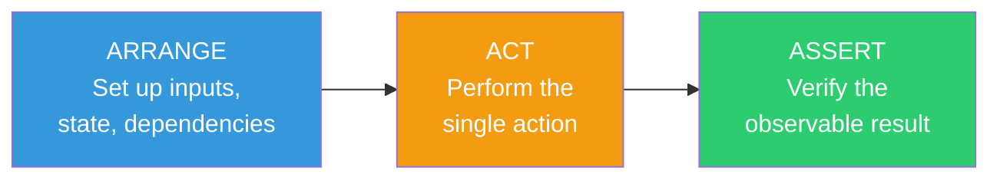
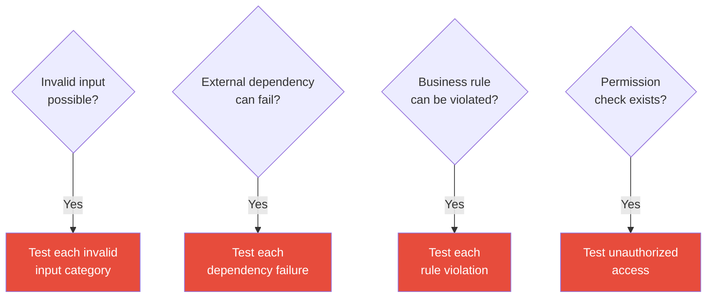

# Test Structure

## AAA Pattern

Every test follows three steps in this exact order:



Label each section with a comment (`# Arrange`, `// Act`, etc.) when the separation is not obvious.

---

## What to Test

**Always test:**

- Happy path — valid input produces the expected output
- Boundary values — empty string, zero, maximum allowed value, null, undefined
- Error paths — see section below
- Business rules — quotas, permission checks, state transitions, validation logic

---

## Error Path Testing

Error paths are as important as happy paths. Every function that can fail must have tests for each failure mode.

**What counts as an error path:**

- Invalid input that should be rejected (wrong type, out of range, missing required field)
- Missing or null values where the code expects a value
- Dependency failure (database unreachable, external API returns error, file not found)
- Permission denied — authenticated but not authorized
- Business rule violation — quota exceeded, state transition not allowed, duplicate entry
- Concurrent modification — optimistic locking failure, race condition

**For each function, ask:**

1. What inputs are invalid? → test each category of invalid input separately
2. What can fail externally? → test each failure mode of each dependency
3. What business rules can be violated? → test each rule with a case that breaks it
4. What happens at the boundaries? → test zero, one, max, and max+1

**Error path decision flow:**



**Error path test checklist:**

```markdown
- [ ] Invalid input types tested
- [ ] Missing required fields tested
- [ ] Out-of-range values tested (below min, above max)
- [ ] Null/undefined inputs tested where not allowed
- [ ] Each external dependency failure tested independently
- [ ] Permission denied tested for each protected operation
- [ ] Each business rule violation tested
- [ ] Concurrent access / duplicate entry tested (if relevant)
- [ ] Correct error type or status code asserted
- [ ] Error message is meaningful (not just "error occurred")
```

**Common mistake:** testing only that an error occurs, without asserting the specific error type, message, or status code.

```text
Wrong:  assert an error was raised
Right:  assert a ValidationError was raised with field "email"

Wrong:  assert the response status is not 200
Right:  assert the response status is 422 with error code "INVALID_EMAIL"
```

---

## What Not to Test

- Private methods or internal state — test through the public interface
- Framework or library behavior — test your code, not third-party code
- Trivial accessors with no logic — getters and setters that do nothing but read/write a field
- Exact log message strings — fragile and low value

---

## Integration Tests

Rules specific to tests that cross system boundaries (database, file system, network):

- Use a real test database, not a mock, for database integration tests.
- Each test must clean up its own data — tests must not depend on execution order.
- Use transactions that roll back after each test where the framework supports it.
- Do not share state between integration tests.

---

## File Organization

Place test files adjacent to the source files they test, or in a parallel directory that mirrors the source structure.
Follow the convention already established in the project.

```text
Option A — co-located:
  src/users/service.[ext]
  src/users/service.test.[ext]

Option B — parallel directory:
  src/users/service.[ext]
  tests/users/service.test.[ext]
```
